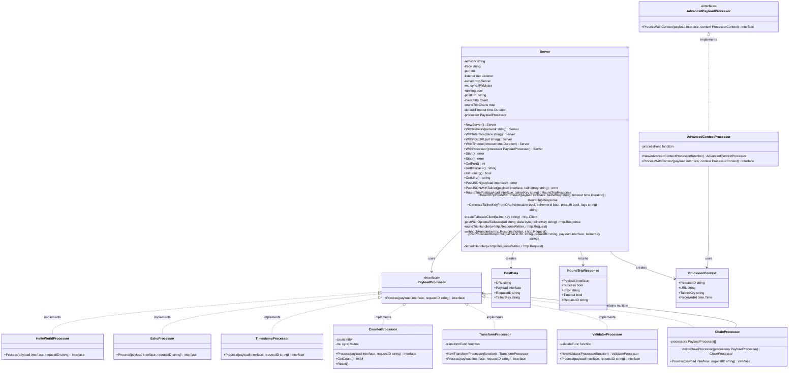

# Class Diagram - Post2Post Library

## Key Relationships

### **Composition**
- `Server` contains configuration, HTTP components, and channels
- `ChainProcessor` contains multiple `PayloadProcessor` instances

### **Interface Implementation**
- Multiple built-in processors implement `PayloadProcessor`
- `AdvancedContextProcessor` implements `AdvancedPayloadProcessor`

### **Dependency**
- `Server` depends on `PayloadProcessor` for request processing
- Processors use `ProcessorContext` for advanced processing

### **Data Flow**
- `PostData` flows into the server
- Processors transform data
- `RoundTripResponse` flows back to clients

## Design Patterns Used

### **Strategy Pattern**
- `PayloadProcessor` interface allows different processing strategies
- Processors can be swapped at runtime

### **Chain of Responsibility**
- `ChainProcessor` implements sequential processing
- Each processor can modify or validate data

### **Builder Pattern**
- `Server` configuration uses fluent interface
- Method chaining for easy setup: `NewServer().WithPort(8080).WithProcessor(processor)`

### **Factory Pattern**
- Constructor functions for processors (e.g., `NewTransformProcessor`)
- `NewServer()` factory method