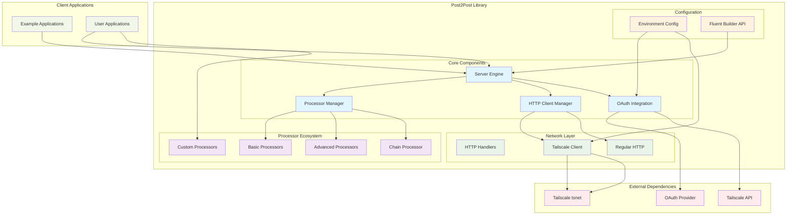
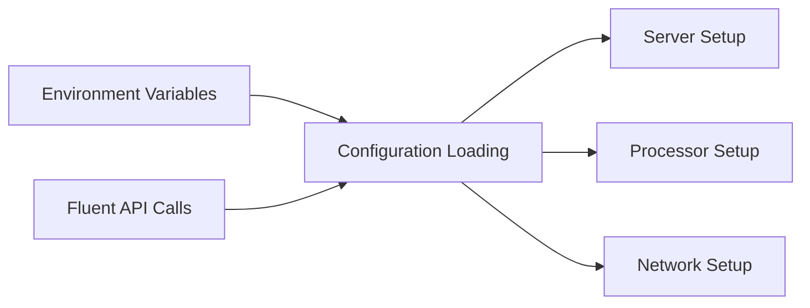
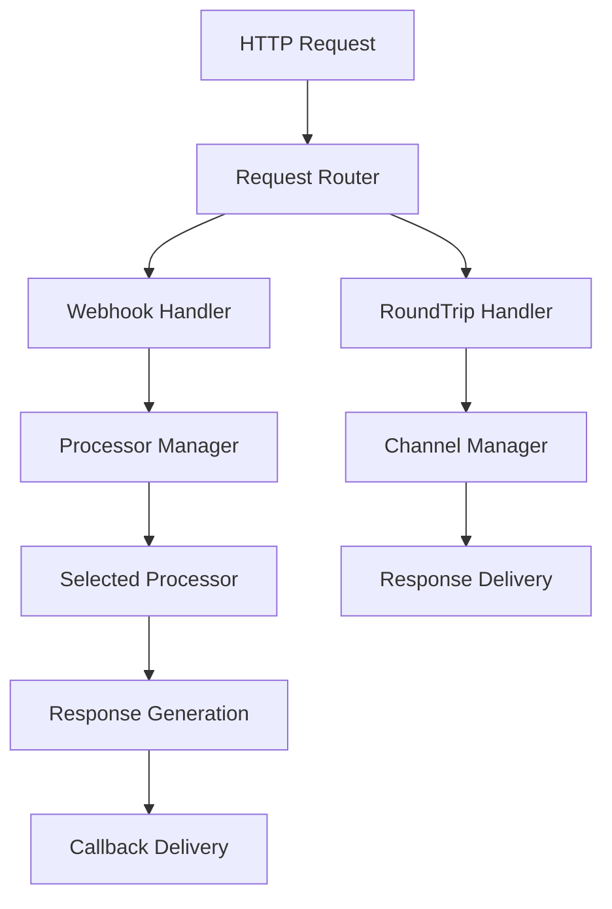
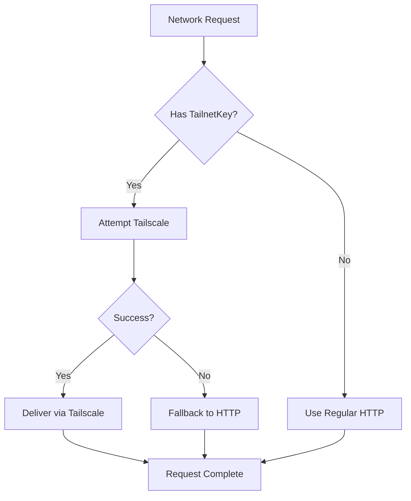
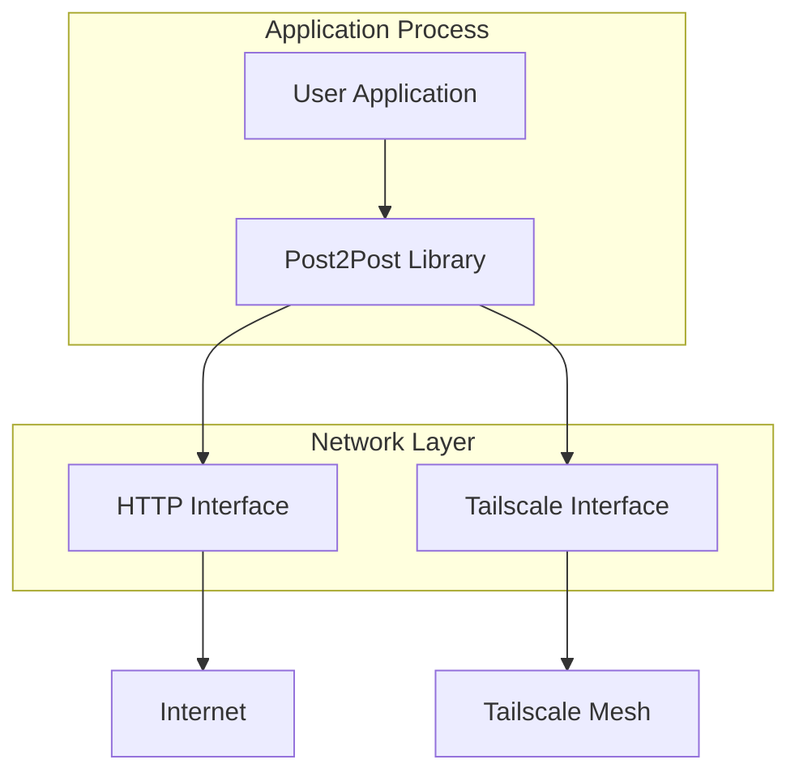
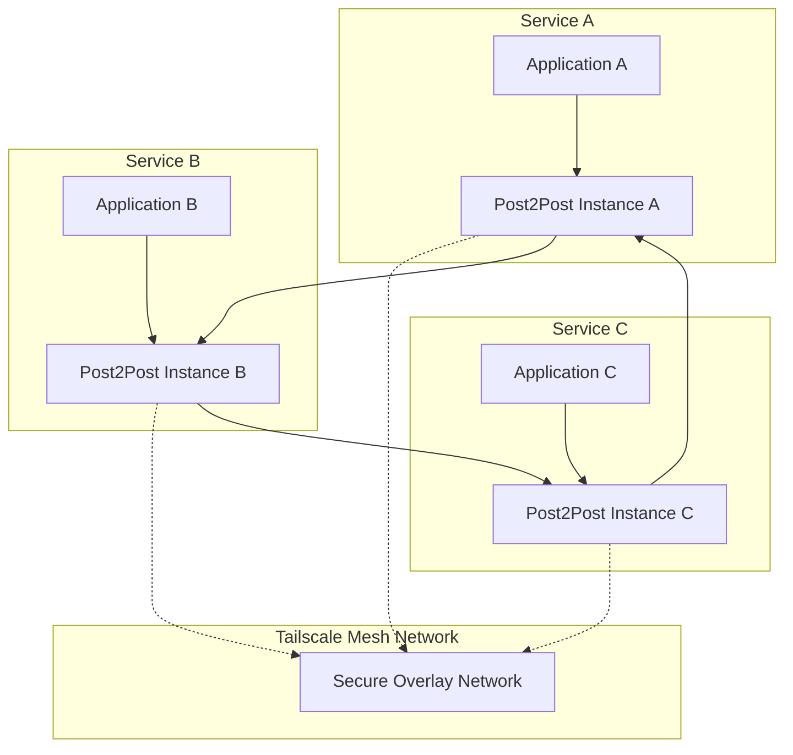

# Component Architecture - Post2Post Library

## High-Level Component View



## Detailed Component Breakdown

### 1. **Server Engine**
**Purpose**: Central orchestrator for HTTP server operations and request lifecycle management

**Responsibilities**:
- HTTP server lifecycle (start/stop)
- Request routing and handling
- Round-trip communication coordination
- Response channel management
- Thread-safe operations

**Key Interfaces**:
```go
type Server struct {
    // Network configuration
    network, iface string
    port int
    
    // HTTP components
    listener net.Listener
    server *http.Server
    client *http.Client
    
    // Round-trip management
    roundTripChans map[string]chan *RoundTripResponse
    
    // Processing
    processor PayloadProcessor
}
```

### 2. **Processor Manager**
**Purpose**: Manages payload processing through configurable processor interfaces

**Components**:
- **Basic Processors**: Simple transformation (Echo, HelloWorld, Timestamp)
- **Advanced Processors**: Context-aware processing with metadata
- **Chain Processor**: Sequential processing pipeline
- **Custom Processors**: User-defined processing logic

**Processing Pipeline**:
```
Request → Processor Selection → Processing → Response Generation → Callback
```

### 3. **OAuth Integration**
**Purpose**: Seamless Tailscale auth key generation using OAuth credentials

**Features**:
- Automatic OAuth token acquisition
- Tailscale API integration
- Ephemeral key generation
- Environment-based configuration

**Flow**:
```
OAuth Credentials → Token Request → Tailscale API → Auth Key → Client Usage
```

### 4. **Network Layer**
**Purpose**: Dual-mode networking with Tailscale and regular HTTP support

**Components**:
- **Tailscale Client**: Secure mesh networking via tsnet
- **Regular HTTP**: Standard HTTP client for fallback
- **HTTP Handlers**: Request routing and response management

**Selection Logic**:
```
If (tailnetKey provided) → Use Tailscale
Else → Use Regular HTTP
If (Tailscale fails) → Fallback to Regular HTTP
```

## Component Interactions

### **Configuration Flow**


### **Request Processing Flow**


### **Network Selection Flow**


## Deployment Architecture

### **Standalone Application**


### **Microservices Architecture**


## Extension Points

### **Custom Processors**
```go
type MyCustomProcessor struct {}

func (p *MyCustomProcessor) Process(payload interface{}, requestID string) (interface{}, error) {
    // Custom processing logic
    return processedPayload, nil
}

// Usage
server := post2post.NewServer().WithProcessor(&MyCustomProcessor{})
```

### **Network Extensions**
- Custom HTTP clients
- Additional security layers
- Protocol adapters
- Monitoring integrations

### **Configuration Extensions**
- Configuration file support
- Dynamic reconfiguration
- Service discovery integration
- Health check endpoints

This component architecture provides a flexible, extensible foundation for HTTP communication with optional security enhancements through Tailscale integration.