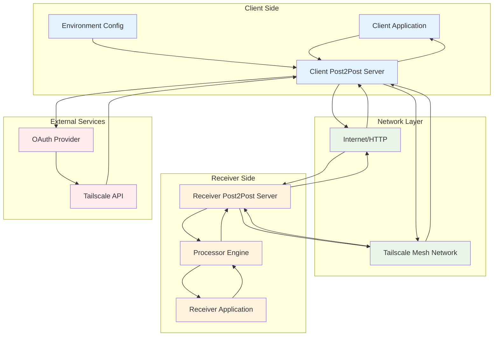
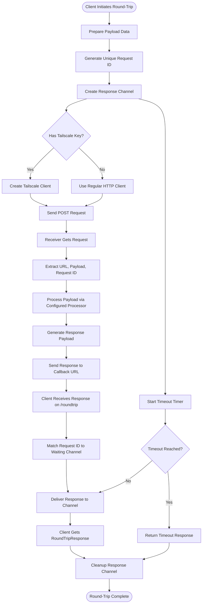
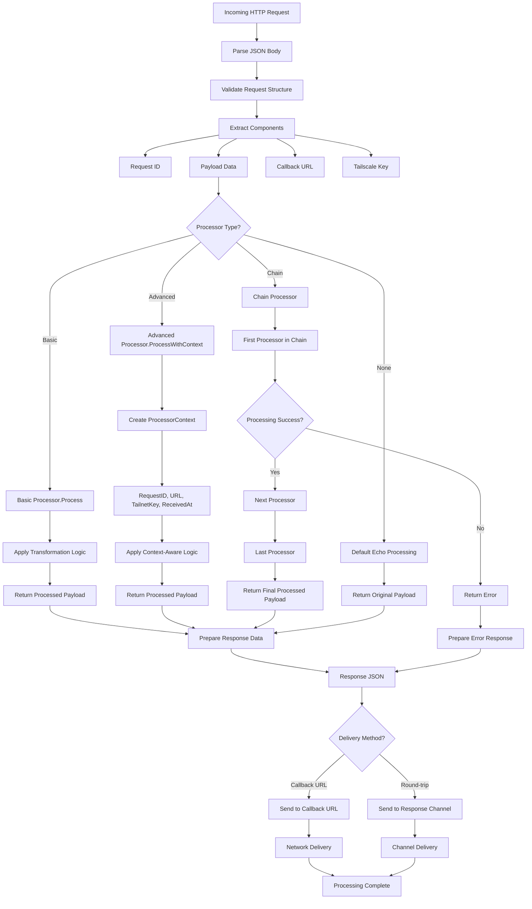
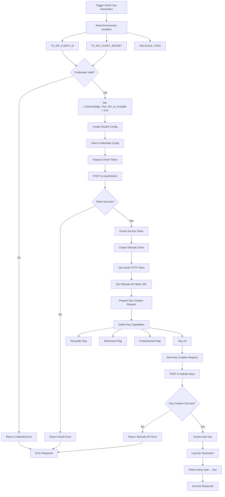
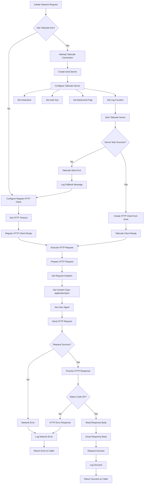

# Data Flow Diagrams - Post2Post Library

## 1. Overall System Data Flow



## 2. Round-Trip Data Flow



## 3. Payload Processing Data Flow



## 4. OAuth Auth Key Generation Data Flow



## 5. Network Selection and Fallback Data Flow



## 6. Configuration Data Flow

```mermaid
flowchart TD
    AppStart[Application Startup] --> LoadConfig[Load Configuration]
    
    LoadConfig --> EnvVars[Environment Variables]
    LoadConfig --> FluentAPI[Fluent API Calls]
    LoadConfig --> Defaults[Default Values]
    
    %% Environment Variables
    EnvVars --> TSClientID[TS_API_CLIENT_ID]
    EnvVars --> TSClientSecret[TS_API_CLIENT_SECRET]
    EnvVars --> TSAuthKey[TAILSCALE_AUTH_KEY]
    EnvVars --> TSTags[TAILSCALE_TAGS]
    EnvVars --> ReceiverURL[RECEIVER_URL]
    EnvVars --> ListenInterface[LISTEN_INTERFACE]
    
    %% Fluent API Configuration
    FluentAPI --> NetworkConfig[WithNetwork(network)]
    FluentAPI --> InterfaceConfig[WithInterface(iface)]
    FluentAPI --> URLConfig[WithPostURL(url)]
    FluentAPI --> TimeoutConfig[WithTimeout(duration)]
    FluentAPI --> ProcessorConfig[WithProcessor(processor)]
    
    %% Configuration Merging
    TSClientID --> ServerConfig[Server Configuration]
    TSClientSecret --> ServerConfig
    TSAuthKey --> ServerConfig
    TSTags --> ServerConfig
    ReceiverURL --> ServerConfig
    ListenInterface --> ServerConfig
    
    NetworkConfig --> ServerConfig
    InterfaceConfig --> ServerConfig
    URLConfig --> ServerConfig
    TimeoutConfig --> ServerConfig
    ProcessorConfig --> ServerConfig
    
    Defaults --> ServerConfig
    
    %% Configuration Validation
    ServerConfig --> ValidateConfig[Validate Configuration]
    ValidateConfig --> ConfigValid{Configuration Valid?}
    
    ConfigValid -->|No| ConfigError[Configuration Error]
    ConfigValid -->|Yes| ApplyConfig[Apply Configuration to Server]
    
    ApplyConfig --> NetworkSetup[Network Setup]
    ApplyConfig --> ProcessorSetup[Processor Setup]
    ApplyConfig --> ClientSetup[HTTP Client Setup]
    ApplyConfig --> OAuthSetup[OAuth Setup]
    
    %% Setup Results
    NetworkSetup --> ServerReady[Server Ready]
    ProcessorSetup --> ServerReady
    ClientSetup --> ServerReady
    OAuthSetup --> ServerReady
    
    ConfigError --> StartupFailed[Startup Failed]
    ServerReady --> StartupSuccess[Startup Success]
```

These data flow diagrams illustrate how information moves through the post2post system, from initial configuration through request processing and response delivery, including error handling and fallback mechanisms.