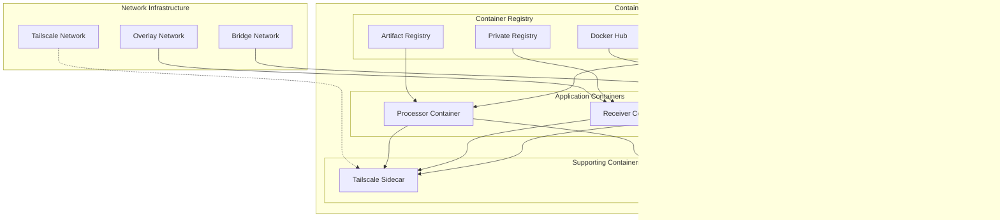

# Deployment Architecture - Post2Post Library

## 1. Deployment Patterns Overview


## 2. Standalone Application Deployment


**Configuration Example:**
```bash
# Environment Setup
export TS_API_CLIENT_ID="tskey-client-abc123"
export TS_API_CLIENT_SECRET="secret-xyz789"
export LISTEN_INTERFACE="0.0.0.0"
export PORT="8080"

# Application Deployment
./my-app-with-post2post
```

## 3. Microservices Architecture


**Kubernetes Deployment Example:**
```yaml
apiVersion: apps/v1
kind: Deployment
metadata:
  name: post2post-service
spec:
  replicas: 3
  selector:
    matchLabels:
      app: post2post-service
  template:
    metadata:
      labels:
        app: post2post-service
    spec:
      containers:
      - name: app
        image: my-app:latest
        env:
        - name: TS_API_CLIENT_ID
          valueFrom:
            secretKeyRef:
              name: tailscale-secrets
              key: client-id
        - name: TS_API_CLIENT_SECRET
          valueFrom:
            secretKeyRef:
              name: tailscale-secrets
              key: client-secret
        ports:
        - containerPort: 8080
```

## 4. Serverless Deployment (AWS Lambda)


**Lambda Function Configuration:**
```go
// lambda/main.go
package main

import (
    "context"
    "github.com/aws/aws-lambda-go/events"
    "github.com/aws/aws-lambda-go/lambda"
    "github.com/pgdad/post2post"
)

func handler(ctx context.Context, request events.APIGatewayProxyRequest) (events.APIGatewayProxyResponse, error) {
    server := post2post.NewServer()
    
    // Generate ephemeral auth key for this invocation
    authKey, err := server.GenerateTailnetKeyFromOAuth(
        true, true, false, "tag:lambda,tag:ephemeral",
    )
    if err != nil {
        return events.APIGatewayProxyResponse{
            StatusCode: 500,
            Body:       err.Error(),
        }, nil
    }
    
    // Process request with Tailscale networking
    // Implementation details...
    
    return events.APIGatewayProxyResponse{
        StatusCode: 200,
        Body:       "Success",
    }, nil
}

func main() {
    lambda.Start(handler)
}
```

## 5. Container Deployment with Docker



**Docker Compose Example:**
```yaml
version: '3.8'
services:
  client:
    build: ./client
    environment:
      - TS_API_CLIENT_ID=${TS_API_CLIENT_ID}
      - TS_API_CLIENT_SECRET=${TS_API_CLIENT_SECRET}
      - RECEIVER_URL=http://receiver:8082/webhook
    depends_on:
      - receiver
    networks:
      - post2post-network
      
  receiver:
    build: ./receiver
    environment:
      - TS_API_CLIENT_ID=${TS_API_CLIENT_ID}
      - TS_API_CLIENT_SECRET=${TS_API_CLIENT_SECRET}
      - LISTEN_INTERFACE=0.0.0.0
    ports:
      - "8082:8082"
    networks:
      - post2post-network
      
  tailscale-sidecar:
    image: tailscale/tailscale:latest
    environment:
      - TS_AUTHKEY=${TS_AUTHKEY}
      - TS_STATE_DIR=/var/lib/tailscale
    volumes:
      - tailscale-state:/var/lib/tailscale
    cap_add:
      - NET_ADMIN
    networks:
      - post2post-network

networks:
  post2post-network:
    driver: bridge

volumes:
  tailscale-state:
```

## 6. CI/CD Pipeline Integration


**GitHub Actions Example:**
```yaml
name: Deploy Post2Post Application
on:
  push:
    branches: [main]
    
jobs:
  deploy:
    runs-on: ubuntu-latest
    steps:
    - uses: actions/checkout@v3
    
    - name: Setup Go
      uses: actions/setup-go@v3
      with:
        go-version: 1.21
        
    - name: Build Application
      run: |
        go build ./...
        
    - name: Test with Tailscale Integration
      env:
        TS_API_CLIENT_ID: ${{ secrets.TS_API_CLIENT_ID }}
        TS_API_CLIENT_SECRET: ${{ secrets.TS_API_CLIENT_SECRET }}
        TAILSCALE_TAGS: "tag:ci,tag:github-actions"
      run: |
        go test ./...
        
    - name: Deploy to Production
      env:
        TS_API_CLIENT_ID: ${{ secrets.PROD_TS_API_CLIENT_ID }}
        TS_API_CLIENT_SECRET: ${{ secrets.PROD_TS_API_CLIENT_SECRET }}
      run: |
        ./deploy-script.sh
```

## 7. Multi-Environment Architecture


This deployment architecture provides flexibility for various infrastructure patterns while maintaining security and scalability through Tailscale integration and proper environment management.