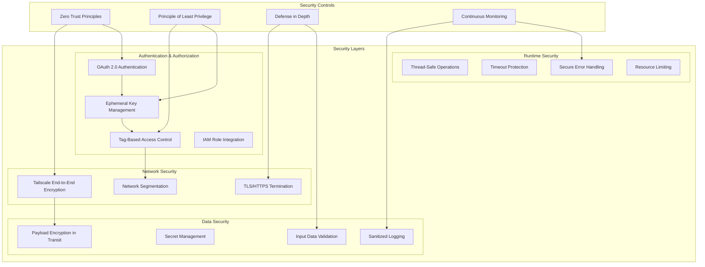
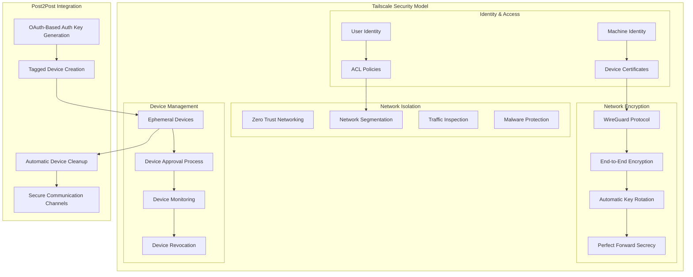
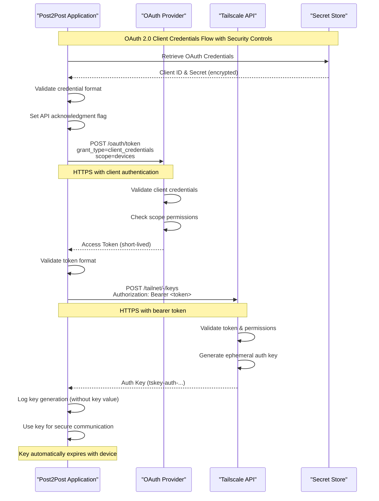
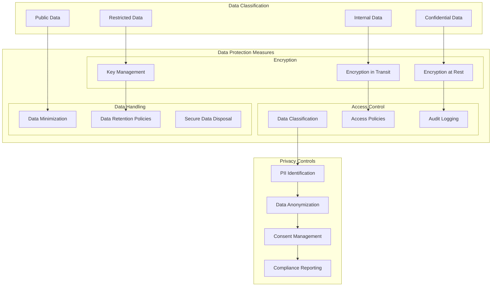
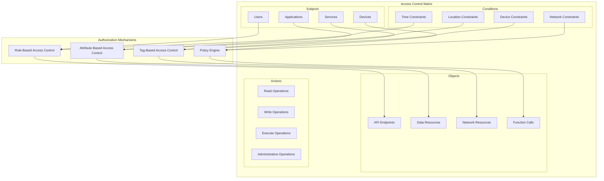
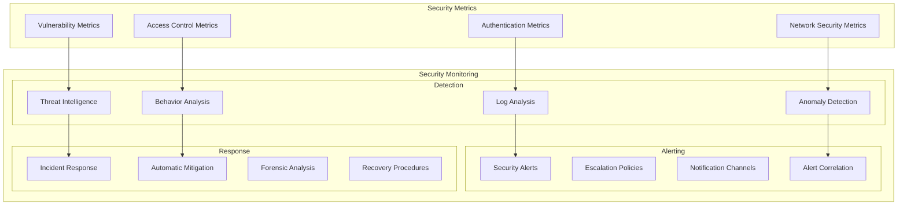
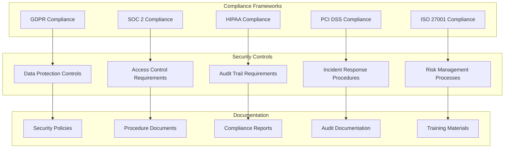

# Security Architecture - Post2Post Library

## 1. Security Overview



## 2. Tailscale Mesh Network Security



### **Tailscale Security Features**

1. **WireGuard Protocol**
   - State-of-the-art VPN protocol
   - Cryptographically sound design
   - Minimal attack surface
   - High performance encryption

2. **Zero Trust Architecture**
   - No implicit trust based on network location
   - Every connection authenticated and authorized
   - Continuous verification of trust
   - Encrypted end-to-end communication

3. **Ephemeral Device Security**
   ```go
   // Automatic ephemeral device creation
   authKey, err := server.GenerateTailnetKeyFromOAuth(
       true,  // reusable for multiple connections
       true,  // ephemeral - automatically removed when offline
       false, // not preauthorized - requires explicit approval
       "tag:ephemeral-device,tag:post2post",
   )
   ```

## 3. OAuth 2.0 Security Implementation



### **OAuth Security Controls**

1. **Credential Management**
   ```go
   // Secure credential handling
   clientID := os.Getenv("TS_API_CLIENT_ID")
   clientSecret := os.Getenv("TS_API_CLIENT_SECRET")
   
   if clientID == "" || clientSecret == "" {
       return "", fmt.Errorf("OAuth credentials not configured")
   }
   
   // Never log sensitive credentials
   log.Printf("Using OAuth client: %s...", clientID[:min(8, len(clientID))])
   ```

2. **Token Security**
   - Short-lived access tokens (1 hour expiry)
   - Automatic token refresh
   - No persistent token storage
   - Secure token transmission (HTTPS only)

3. **Scope Limitation**
   ```go
   credentials := clientcredentials.Config{
       ClientID:     clientID,
       ClientSecret: clientSecret,
       TokenURL:     "https://api.tailscale.com/api/v2/oauth/token",
       Scopes:       []string{"devices"}, // Minimal required scope
   }
   ```

## 4. Data Protection and Privacy



### **Data Protection Implementation**

1. **Payload Security**
   ```go
   // Secure payload handling
   func (s *Server) webhookHandler(w http.ResponseWriter, r *http.Request) {
       // Read body with size limits
       body, err := io.ReadAll(io.LimitReader(r.Body, MaxPayloadSize))
       if err != nil {
           log.Printf("Error reading request body: %v", err)
           http.Error(w, "Request too large", http.StatusRequestEntityTooLarge)
           return
       }
       
       // Validate JSON structure
       var requestData PostData
       if err := json.Unmarshal(body, &requestData); err != nil {
           log.Printf("Invalid JSON payload")
           http.Error(w, "Invalid JSON", http.StatusBadRequest)
           return
       }
       
       // Sanitize for logging (remove sensitive data)
       sanitizedPayload := sanitizeForLogging(requestData.Payload)
       log.Printf("Processing payload: %+v", sanitizedPayload)
   }
   ```

2. **Secret Management**
   ```go
   // Secure secret handling
   func sanitizeForLogging(data interface{}) interface{} {
       // Remove sensitive fields from logging
       sensitiveFields := []string{
           "password", "secret", "key", "token", 
           "auth", "credential", "private",
       }
       
       // Implementation to redact sensitive data
       return redactSensitiveData(data, sensitiveFields)
   }
   ```

## 5. Access Control and Authorization



### **Tailscale ACL Configuration**

```json
{
  "tagOwners": {
    "tag:post2post-client": [],
    "tag:post2post-receiver": [],
    "tag:ephemeral-device": [],
    "tag:production": ["admin@company.com"],
    "tag:development": ["dev-team@company.com"]
  },
  
  "groups": {
    "group:post2post-admins": ["admin@company.com"],
    "group:post2post-developers": ["dev1@company.com", "dev2@company.com"],
    "group:post2post-services": []
  },
  
  "acls": [
    {
      "action": "accept",
      "src": ["group:post2post-admins"],
      "dst": ["*:*"]
    },
    {
      "action": "accept", 
      "src": ["tag:post2post-client"],
      "dst": ["tag:post2post-receiver:8080", "tag:post2post-receiver:8082"]
    },
    {
      "action": "accept",
      "src": ["tag:ephemeral-device"],
      "dst": ["tag:post2post-receiver:8080", "tag:post2post-receiver:8082"]
    },
    {
      "action": "accept",
      "src": ["tag:development"],
      "dst": ["tag:development:*"]
    },
    {
      "action": "deny",
      "src": ["tag:development"],
      "dst": ["tag:production:*"]
    }
  ]
}
```

## 6. Security Monitoring and Incident Response



### **Security Logging Implementation**

```go
// Security-focused logging
type SecurityLogger struct {
    logger *log.Logger
}

func (sl *SecurityLogger) LogAuthenticationAttempt(clientID string, success bool, reason string) {
    event := SecurityEvent{
        Type:      "authentication",
        Timestamp: time.Now(),
        ClientID:  redactSensitive(clientID),
        Success:   success,
        Reason:    reason,
        Source:    getClientIP(),
    }
    
    sl.logger.Printf("SECURITY_EVENT: %+v", event)
    
    if !success {
        sl.alertSecurityTeam("Authentication failure", event)
    }
}

func (sl *SecurityLogger) LogNetworkConnection(sourceIP, destIP string, protocol string, success bool) {
    event := SecurityEvent{
        Type:      "network_connection",
        Timestamp: time.Now(),
        SourceIP:  sourceIP,
        DestIP:    destIP,
        Protocol:  protocol,
        Success:   success,
    }
    
    sl.logger.Printf("SECURITY_EVENT: %+v", event)
    
    // Check for suspicious patterns
    if sl.detectAnomalousTraffic(sourceIP, destIP) {
        sl.alertSecurityTeam("Anomalous network traffic", event)
    }
}
```

## 7. Compliance and Regulatory Considerations



This security architecture ensures that the post2post library provides robust protection at multiple layers while maintaining usability and performance. The integration with Tailscale's zero-trust networking model adds an additional layer of security for sensitive communications.