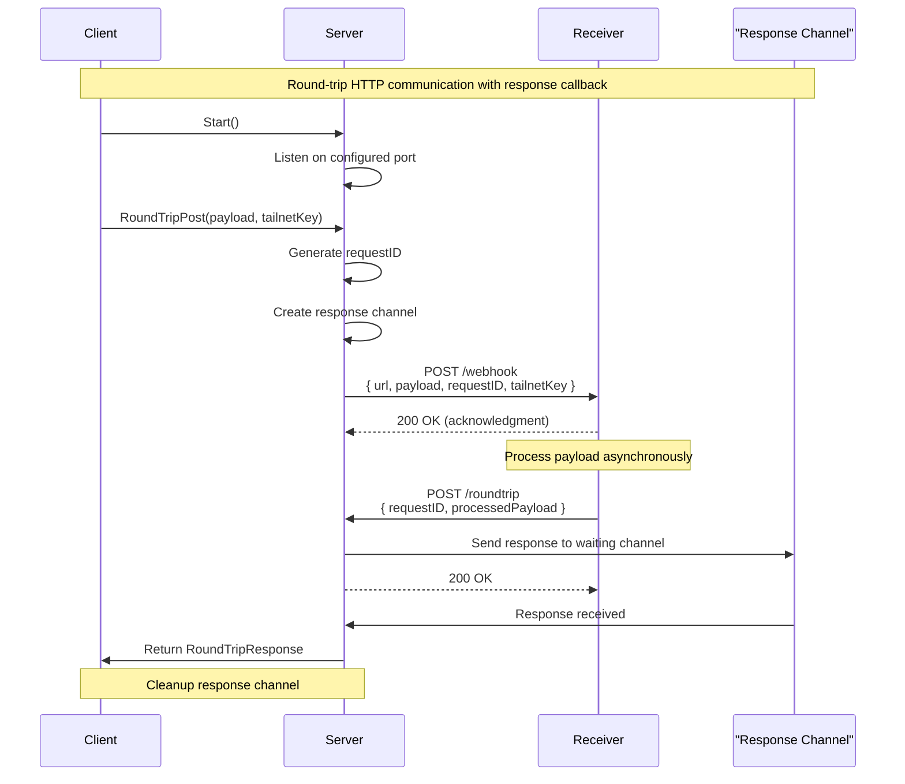
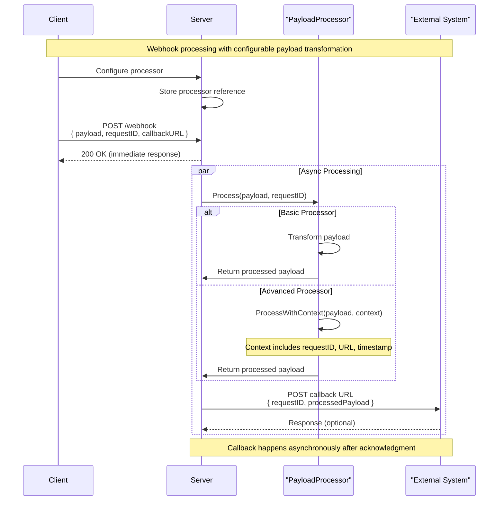
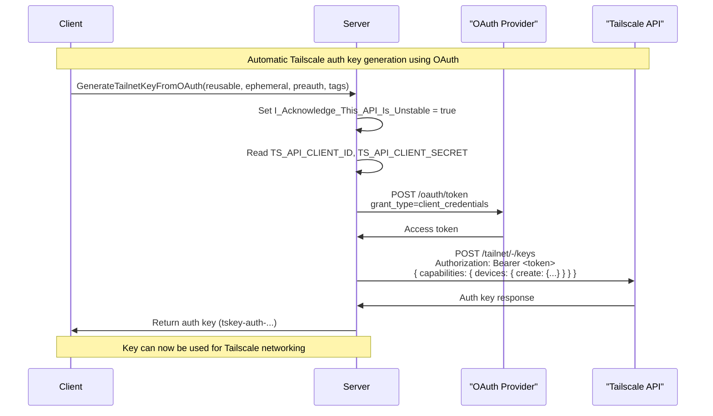
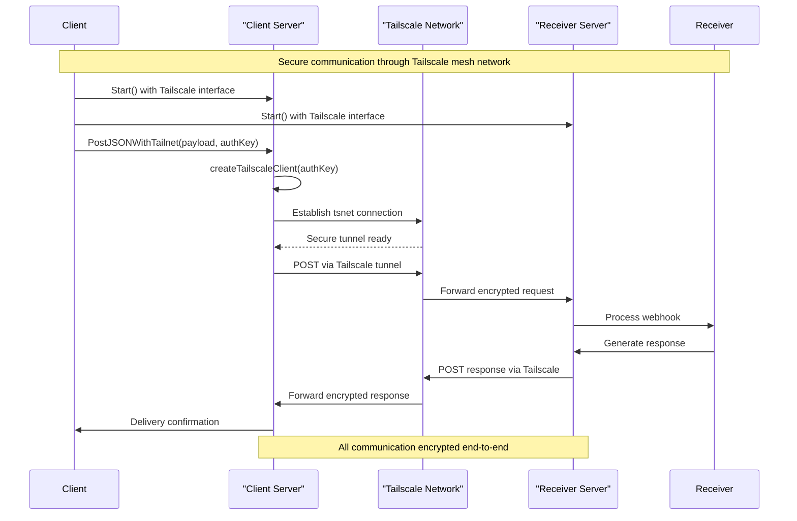
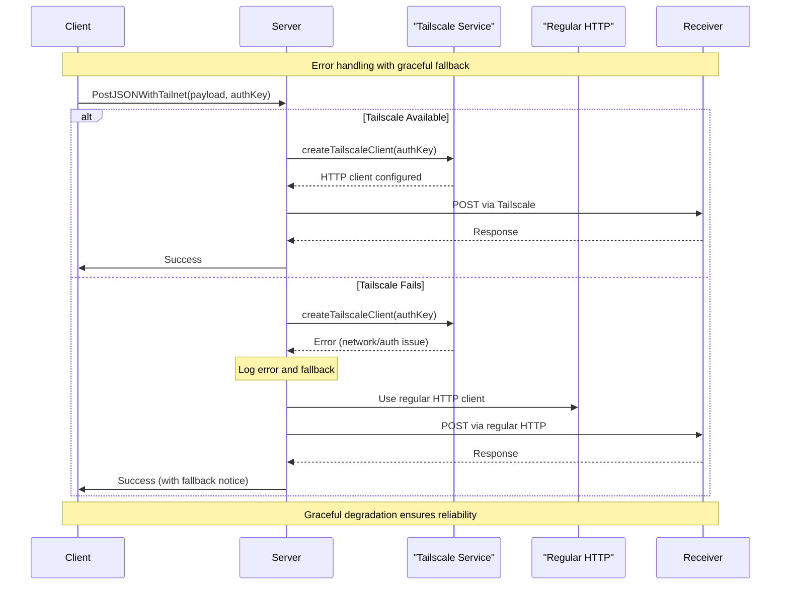
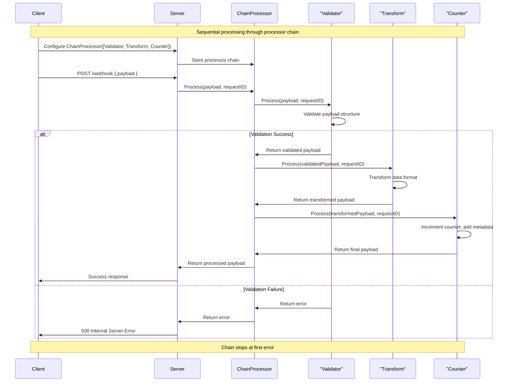

# Sequence Diagrams - Post2Post Library

## 1. Round-Trip Post Sequence

## 2. Webhook Processing with Payload Processors

## 3. OAuth Auth Key Generation

## 4. Tailscale-Enhanced Communication

## 5. Error Handling and Fallback

## 6. Chain Processor Sequence

These sequence diagrams illustrate the key interaction patterns in the post2post library, showing how components collaborate to provide flexible HTTP communication with optional security enhancements.